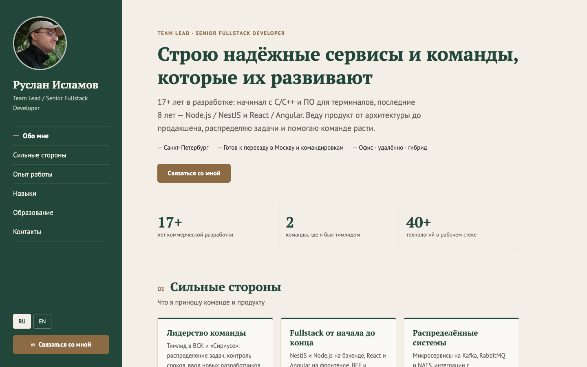

# Портфолио Руслана Исламова

Одностраничный сайт-портфолио Team Lead / Senior Fullstack Developer для работодателей: опыт работы, сильные стороны,
навыки и форма обратной связи. Сайт работает на русском и английском языках и адаптирован под телефоны.



## Возможности

- **Разделы**: обо мне, сильные стороны, опыт работы, навыки, образование, контакты.
- **Два языка со своими адресами** — `/ru/` и `/en/`, ссылкой на нужную версию можно поделиться. Корень сайта сам
  переходит на язык, выбранный в прошлый раз, или на язык браузера.
- **Форма связи** — имя, обратный контакт и сообщение отправляются в Google Apps Script, который пересылает заявку
  на почту.
- **Кнопка «Связаться со мной» всегда под рукой**: на компьютере — в боковой панели и плавающей кнопкой справа
  внизу, на телефоне — полосой внизу экрана. Плавающая кнопка прячется, когда на экране уже видна форма.
- **Стаж считается автоматически** по датам мест работы, поэтому цифры на сайте не устаревают.
- **Адаптивная вёрстка** для экранов от 320 px, доступность с клавиатуры и для экранных дикторов.

## Технологии

React 19, TypeScript, Vite, CSS Modules. Без UI-библиотек и библиотек локализации.
Тесты — Vitest и Testing Library, проверка кода — ESLint и Prettier.

## Запуск

Нужен Node.js 20.19+ или 22.12+ (требование Vite).

```bash
npm install
npm run dev        # сервер разработки: http://localhost:5173
```

| Команда             | Что делает                                |
| ------------------- | ----------------------------------------- |
| `npm run dev`       | сервер разработки с горячей перезагрузкой |
| `npm run build`     | проверка типов и сборка в папку `dist/`   |
| `npm run preview`   | локальный просмотр собранной версии       |
| `npm test`          | тесты                                     |
| `npm run lint`      | ESLint                                    |
| `npm run typecheck` | проверка типов TypeScript                 |
| `npm run format`    | форматирование кода Prettier              |

## Публикация

`npm run build` создаёт статический сайт в `dist/`. Его можно выложить на любой статический хостинг
(GitHub Pages, Netlify, Vercel, обычный веб-сервер). Пути в сборке относительные (`base: './'`), поэтому сайт
работает и из корня домена, и из подпапки.

```
dist/
├── index.html      корень: переводит на /ru/ или /en/
├── ru/index.html   русская версия
├── en/index.html   английская версия
└── assets/         скрипты, стили, фото
```

Страницы `ru/` и `en/` создаёт плагин сборки [`build/locale-pages-plugin.ts`](build/locale-pages-plugin.ts).
Это обычные файлы, поэтому ссылки `/ru/` и `/en/` открываются и после обновления страницы без настройки сервера,
а в превью ссылки в мессенджере сразу видны заголовок и описание на нужном языке. Тексты превью —
[`src/shared/i18n/page-meta.ts`](src/shared/i18n/page-meta.ts).

## Языки и адреса

| Адрес         | Что открывается                                                           |
| ------------- | ------------------------------------------------------------------------- |
| `/ru/`        | русская версия                                                            |
| `/en/`        | английская версия                                                         |
| `/`           | переход на `/ru/` или `/en/`: сохранённый выбор → язык браузера → русский |
| `/en/#skills` | английская версия сразу на нужном разделе                                 |

Переключатель RU / EN меняет адрес без перезагрузки и сохраняет раздел, на котором вы находитесь; кнопки
«назад/вперёд» в браузере возвращают предыдущий язык.

## Как поменять содержимое

Все тексты резюме лежат в одном файле — [`src/shared/data/profile.ts`](src/shared/data/profile.ts).
Каждая строка задаётся на двух языках: `{ ru: '…', en: '…' }`.

| Что изменить                             | Где                                                                                 |
| ---------------------------------------- | ----------------------------------------------------------------------------------- |
| Заголовок, текст первого экрана, условия | `headline`, `lead`, `workConditions` в `profile.ts`                                 |
| Сильные стороны                          | `strengths` в `profile.ts`                                                          |
| Места работы                             | `jobs` в `profile.ts`, от нового к старому                                          |
| Навыки                                   | `skillGroups` в `profile.ts`                                                        |
| Образование и языки                      | `education`, `languages` в `profile.ts`                                             |
| Надписи интерфейса (меню, кнопки, форма) | [`src/shared/i18n/ru.ts`](src/shared/i18n/ru.ts) и [`en.ts`](src/shared/i18n/en.ts) |
| Фото                                     | [`src/shared/assets/photo.jpg`](src/shared/assets/photo.jpg), квадратное            |
| Цвета и шрифты                           | переменные в [`src/app/global.css`](src/app/global.css)                             |

**Даты и стаж.** У места работы указываются `start` и `end` (`{ year, month }`); `end: null` означает
«по настоящее время». Длительность считается включительно, как на hh.ru. Общий стаж — от начала первой работы
до окончания последней (или до текущего месяца, если есть текущее место работы). В тексте первого экрана
плейсхолдеры `{total}` и `{recent}` заменяются на общий стаж и стаж на текущем стеке — его начало задаёт
`currentStackSince`.

## Форма связи

- Адрес Google Apps Script и ограничения длины полей —
  [`src/shared/config/contact.const.ts`](src/shared/config/contact.const.ts).
- Заявка уходит POST-запросом с JSON-телом `{ "name": "…", "contact": "…", "message": "…" }` и заголовком
  `Content-Type: text/plain`. Скрипт читает её через `JSON.parse(e.postData.contents)`.
- Запрос идёт в режиме `no-cors`: заявка гарантированно доходит, но ответ скрипта браузер прочитать не даёт.
  Поэтому «отправлено» означает, что запрос ушёл без сетевой ошибки.
- Ограничения: имя и контакт — до 200 символов, сообщение — до 2000 со счётчиком оставшихся символов.
- От ботов защищает скрытое поле-ловушка: если оно заполнено, заявка не отправляется.

## Структура проекта

```
src/
├── app/            корневой компонент, раскладка страницы, глобальные стили
├── widgets/        секции страницы: hero, strengths, experience, skills, education,
│                   contact-section, navigation (боковая панель и мобильная шапка),
│                   floating-cta (всегда видимая кнопка), footer
├── features/
│   ├── contact/            форма связи, проверка полей, отправка, модальное окно
│   └── language-switcher/  переключатель RU / EN
├── shared/
│   ├── config/     константы: адрес формы, лимиты полей, настройки языка
│   ├── data/       данные резюме и расчёт ключевых цифр
│   ├── i18n/       словари интерфейса и контекст языка
│   ├── lib/        enum'ы, типы, расчёт стажа, хуки прокрутки
│   ├── ui/         базовые компоненты: кнопка, секция, метки, модальное окно
│   └── assets/     фото
└── test/           настройка тестового окружения
build/              плагин сборки страниц /ru/ и /en/
docs/               снимок экрана для README
```

## Личные данные

Телефон, почта, ник в Telegram и зарплатные ожидания на сайт не выводятся. Это проверяет отдельный тест
в [`src/app/App.test.tsx`](src/app/App.test.tsx). Исходный PDF резюме (`person.pdf`) указан в `.gitignore`
и в репозиторий не попадает.
